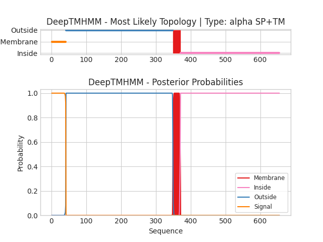

## DeepTMHMM - Predictions
Predicted topologies can be downloaded in [.gff3 format](TMRs.gff3) and [.3line format](predicted_topologies.3line)

You can download the probabilities used to generate this plot [here](P32241_probs.csv)
### Predicted Topologies
```
>P32241 | SP+TM
MGTSPSSSTALASCSRIARRATATMIAGSLLLLGFLSTTTAQPEQKASNLIGTYRHVDRATGQVLTCDKCPAGTYVSEHCTNTSLRVCSSCPVGTFTRHENGIEKCHDCSQPCPWPMIEKLPCAALTDRECTCPPGMFQSNATCAPHTVCPVGWGVRKKGTETEDVRCKQCARGTFSDVPSSVMKCKAYTDCLSQNLVVIKPGTKETDNVCGTLPSFSSSTSPSPGTAIFPRPEHMETHEVPSSTYVPKGMNSTESNSSASVRPKVLSSIQEGTVPDNTSSARGKEDVNKTLPNLQVVNHQQGPHHRHILKLLPSMEATGGEKSSTPIKGPKRGHPRQNLHKHFDINEHLPWMIVLFLLLVLVVIVVCSIRKSSRTLKKGPRQDPSAIVEKAGLKKSMTPTQNREKWIYYCNGHGIDILKLVAAQVGSQWKDIYQFLCNASEREVAAFSNGYTADHERAYAALQHWTIRGPEASLAQLISALRQHRRNDVVEKIRGLMEDTTQLETDKLALPMSPSPLSPSPIPSPNAKLENSALLTVEPSPQDKNKGFFVDESEPLLRCDSTSSGSSALSRNGSFITKEKKDTVLRQVRLDPCDLQPIFDDMLHFLNPEELRVIEEIPQAEDKLDRLFEIIGVKSQEASQTLLDSVYSHLPDLL
SSSSSSSSSSSSSSSSSSSSSSSSSSSSSSSSSSSSSSSSSOOOOOOOOOOOOOOOOOOOOOOOOOOOOOOOOOOOOOOOOOOOOOOOOOOOOOOOOOOOOOOOOOOOOOOOOOOOOOOOOOOOOOOOOOOOOOOOOOOOOOOOOOOOOOOOOOOOOOOOOOOOOOOOOOOOOOOOOOOOOOOOOOOOOOOOOOOOOOOOOOOOOOOOOOOOOOOOOOOOOOOOOOOOOOOOOOOOOOOOOOOOOOOOOOOOOOOOOOOOOOOOOOOOOOOOOOOOOOOOOOOOOOOOOOOOOOOOOOOOOOOOOOOOOOOOOOOOOOOOOOOOOOOOOOOOOOOOOOOOOOOOOOOOOMMMMMMMMMMMMMMMMMMMMMIIIIIIIIIIIIIIIIIIIIIIIIIIIIIIIIIIIIIIIIIIIIIIIIIIIIIIIIIIIIIIIIIIIIIIIIIIIIIIIIIIIIIIIIIIIIIIIIIIIIIIIIIIIIIIIIIIIIIIIIIIIIIIIIIIIIIIIIIIIIIIIIIIIIIIIIIIIIIIIIIIIIIIIIIIIIIIIIIIIIIIIIIIIIIIIIIIIIIIIIIIIIIIIIIIIIIIIIIIIIIIIIIIIIIIIIIIIIIIIIIIIIIIIIIIIIIIIIIIIIIIIIIIIIIIIIIIIIIIIIIIIII

```


```
##gff-version 3
# P32241 Length: 655
# P32241 Number of predicted TMRs: 1
P32241	signal	1	41				
P32241	outside	42	349				
P32241	TMhelix	350	370				
P32241	inside	371	655				

```
